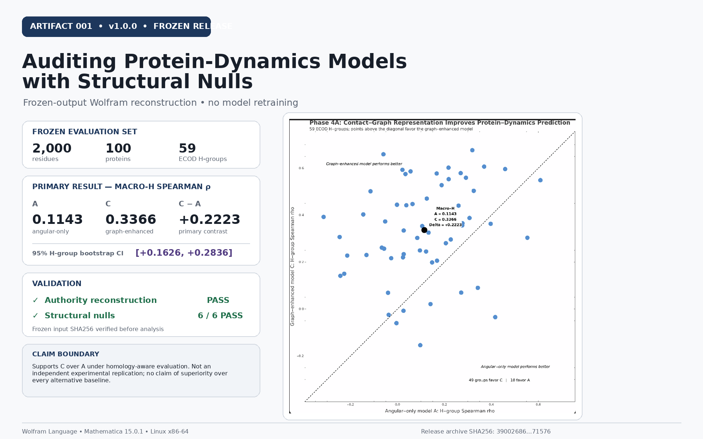

# Auditing Protein-Dynamics Models with Structural Nulls



A reproducible **Wolfram Language** reconstruction and audit of a homology-aware protein-dynamics benchmark from frozen experimental outputs.

## At a glance

- **2,000** held-out residue predictions
- **100** proteins
- **59** ECOD H-groups
- Macro-H Spearman rho:
  - Angular-only model **A = 0.1143**
  - Graph-enhanced model **C = 0.3366**
- Primary contrast: **C − A = +0.2223**
- 95% H-group bootstrap CI: **[+0.1626, +0.2836]**
- Persisted authority reconstruction: **PASS**
- Structural null audit: **6 / 6 PASS**

## Scientific question

Does adding static contact-graph information improve residue-level protein-dynamics prediction beyond an angular-only structural baseline when performance is evaluated across homology-aware ECOD H-groups?

## What this repository demonstrates

- per-protein Spearman reconstruction
- equal-weight ECOD H-group aggregation
- validation against persisted benchmark authority
- structural-null controls
- H-group bootstrap uncertainty
- an interactive Mathematica H-group explorer
- frozen-input SHA256 verification
- relative-path execution
- a versioned, checksum-verified release

## Reviewer path

1. Open [`media/HERO_RESULT.png`](media/HERO_RESULT.png).
2. Open [`media/EXPLORER_SCREENSHOT.png`](media/EXPLORER_SCREENSHOT.png).
3. Read the [`90-second reviewer proof packet`](docs/REVIEWER_PROOF_PACKET.md).
4. Inspect [`release/v1.0.0/protein_model_audit_final.nb`](release/v1.0.0/protein_model_audit_final.nb).
5. Verify the release:

```bash
cd release/v1.0.0
./verify_artifact.sh
sha256sum -c MANIFEST.sha256
```

## Frozen release

Canonical release: [`release/v1.0.0/`](release/v1.0.0/)

Archive: [`release/artifact_001-v1.0.0.tar.gz`](release/artifact_001-v1.0.0.tar.gz)

Archive SHA256:

```text
39002686a9409d0160de8511075889656af0721d81c4e8b924cfb5a233771576
```

## Claim boundary

This artifact is an **independent Wolfram Language reconstruction of a reported metric from frozen experimental outputs**.

It does **not** retrain the underlying models and should not be described as an independent experimental replication.

The result supports model C over model A under the reported homology-aware evaluation. It does not establish superiority over every alternative representation; pLDDT reaches a similar Macro-H score.

No quantum-advantage claim is made.

## Reproducibility authority

Canonical experimental run: `run_20260824T154329Z`

Run commit: `44945311f38bcdeb7b45be911fc8432bcc275d79`

Frozen input SHA256:

`3a42e891ebf54e141544b675ee5c113842bda57cef6212b89942aea4ace04d26`

Canonical notebook SHA256:

`30493ddec9a7bb796c6f06b3bbc172bfdd46b78e7360d6746297ba0f99709318`

## Environment

Validated with Wolfram Mathematica 15.0.1 on Linux x86-64.
